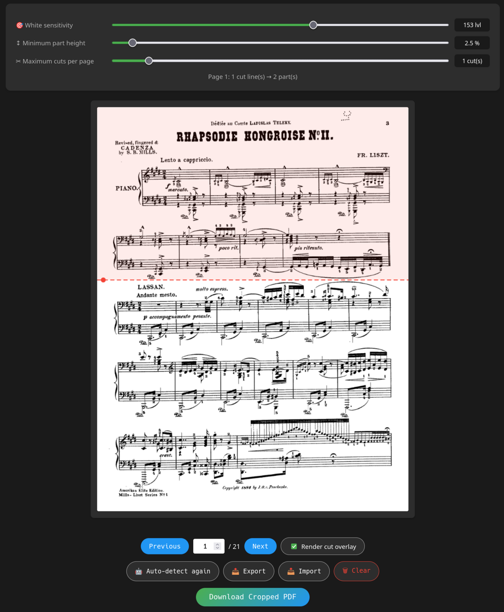

# Sheet Music PDF Cropper

This is a tool to automatically crop PDF files in horizontal lines, dividing pages into smaller ones, making it easier to read sheet music on tablets in horizontal orientation:

The tool automatically detects empty regions as an initial baseline. The user can then customize (drag/add/delete) the crop locations.